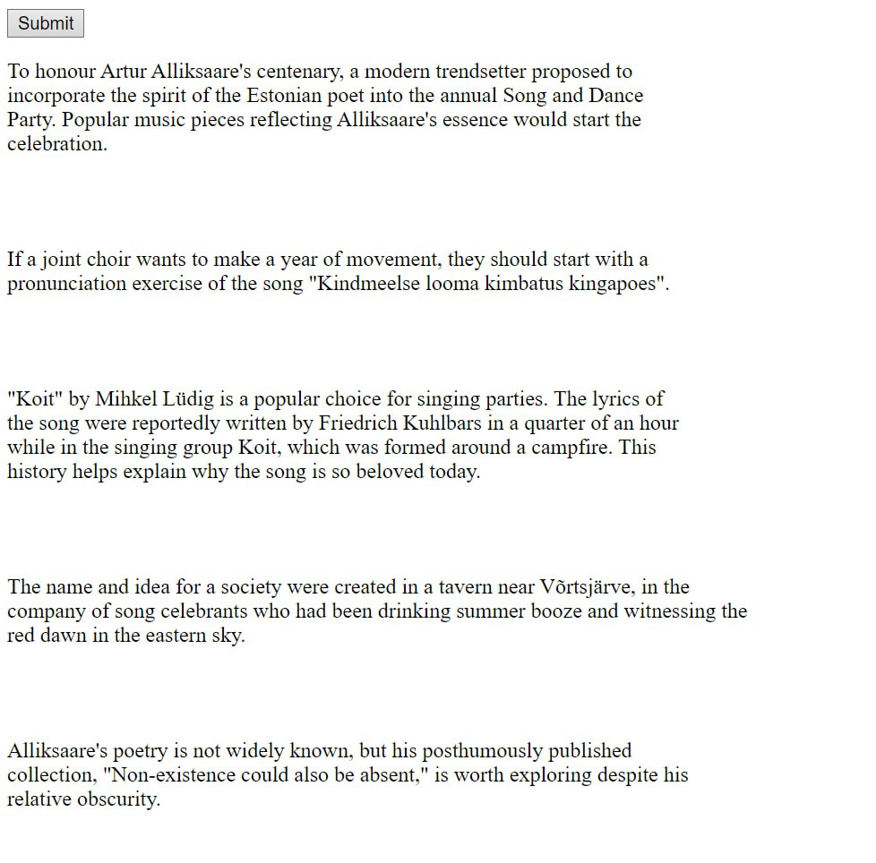
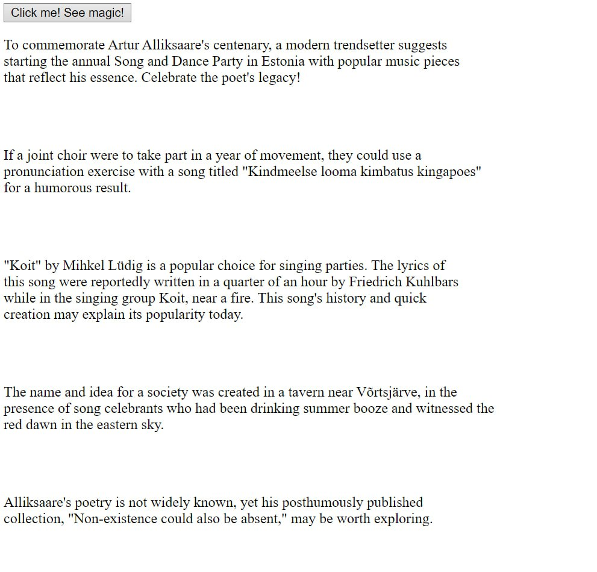

# enginator_kvakozyabra
<h1>Basic outline of project</h1>
 

 Run web.py to run the program 

This code sends highly specific prompt to the openAI API.   The response is displayed after pressing the button "Click me! See magic! ".  

The response is displayed in HTML form

Required libraries: Flask, openai, 

Example of 1st run: 
Example of 2nd run: 
Example when the API connection is not established: 
